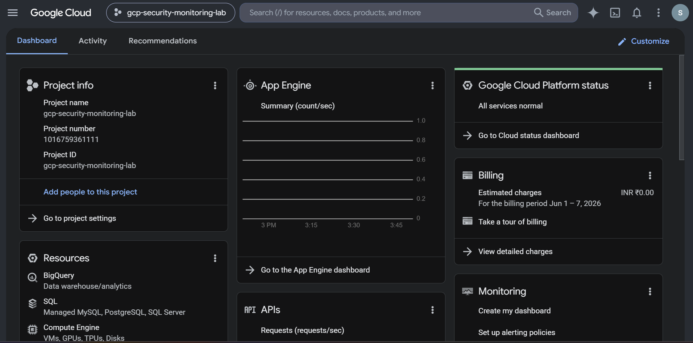
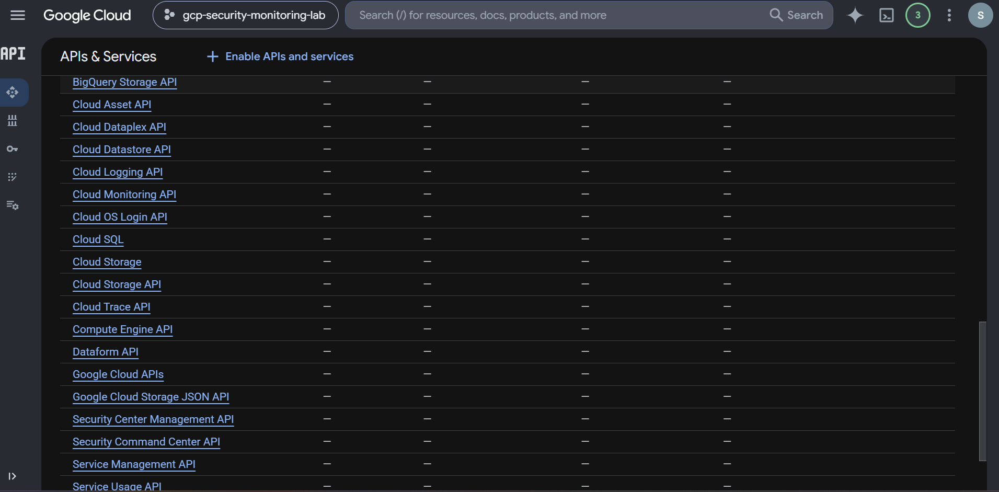

# GCP Security Monitoring and Logging Lab

## Google Cloud Platform (GCP) Cloud Security Monitoring Project

This project demonstrates the implementation of security monitoring, audit logging, cloud alerting, detection engineering, and IAM security assessment using native Google Cloud Platform services.

The project simulates real-world Cloud Security Engineer responsibilities by building a cloud monitoring workflow capable of collecting audit events, generating security telemetry, creating alert policies, and reviewing cloud access permissions.

---

# Project Architecture

```text
Cloud Activity
      │
      ▼
Cloud Audit Logs
      │
      ▼
Cloud Logging
      │
      ▼
Log-Based Metrics
      │
      ▼
Cloud Monitoring
      │
      ▼
Alert Policies
      │
      ▼
Security Investigation
```

---

# Repository Structure

```text
GCP-Security-Monitoring-Logging-Lab/
│
├── README.md
│
├── docs/
│   ├── Project-Overview.md
│   ├── Cloud-Audit-Logs-Analysis.md
│   ├── Log-Based-Metric-Implementation.md
│   ├── Cloud-Monitoring-Alerting.md
│   ├── IAM-Security-Review.md
│   ├── Security-Recommendations.md
│   └── Cleanup-Steps.md
│
├── reports/
│   └── GCP-Security-Monitoring-Logging-Report.pdf
│
├── screenshots/
│   ├── 01-GCP-Project-Created.png
│   ├── 02-Required-APIs-Enabled.png
│   ├── 03-Security-Command-Center-Access.png
│   ├── 04-Security-Command-Center-Restriction.png
│   ├── 05-Cloud-Audit-Logs-Review.png
│   ├── 06-Log-Based-Metric-Created.png
│   ├── 07-Alert-Policy-Created.png
│   ├── 08-IAM-Security-Review.png
│
├── findings/
│   ├── Security-Findings.md
│   └── Risk-Assessment.md
│
└── assets/
    └── architecture-diagram.png
```

---

# Technologies Used

* Google Cloud Platform (GCP)
* Cloud Logging
* Cloud Monitoring
* Cloud Audit Logs
* Compute Engine
* IAM & Admin
* Log-Based Metrics
* Alert Policies

---

# Project Objectives

* Monitor cloud resource activity
* Analyze audit logs
* Create security detections
* Build log-based metrics
* Configure automated alerts
* Review IAM permissions
* Apply cloud security best practices
* Document findings professionally

---

# Step 1 – Create GCP Project

Created a dedicated cloud security project.

### Screenshot



### Outcome

Dedicated cloud security lab environment established.

---

# Step 2 – Enable Required APIs

Enabled:

* Cloud Logging API
* Cloud Monitoring API
* Compute Engine API
* Cloud Asset API
* Security Command Center API

### Screenshot



### Outcome

Security monitoring services successfully enabled.

---

# Step 3 – Security Command Center Review

Attempted to access Security Command Center.

### Screenshot


### Screenshot


### Finding

Security Command Center requires an organization-level environment and is unavailable in personal GCP projects.

### Security Impact

Alternative monitoring controls were implemented using:

* Cloud Logging
* Audit Logs
* Monitoring
* Alert Policies

---

# Step 4 – Audit Log Analysis

Investigated administrative activity through Cloud Logging.

### Query

```text
resource.type="audited_resource"
```

### Screenshot


### Events Identified

* EnableService
* Service Usage
* GetOperation
* Cloud OS Config
* Administrative Changes

### Outcome

Verified visibility into cloud administrative activity.

---

# Step 5 – Detection Engineering

Created a custom log-based metric.

### Metric

```text
vm_activity_metric
```

### Screenshot


### Purpose

Track Compute Engine administrative activity and convert audit logs into security telemetry.

### Outcome

Custom security detection metric successfully deployed.

---

# Step 6 – Alerting Configuration

Configured Cloud Monitoring alert policies.

### Alert Policy

```text
GCE VM Activity Alert
```

### Screenshot


### Alert Flow

```text
Cloud Activity
      ↓
Audit Logs
      ↓
Log-Based Metric
      ↓
Alert Policy
      ↓
Security Notification
```

### Outcome

Automated security monitoring successfully implemented.

---

# Step 7 – IAM Security Assessment

Reviewed project-level access permissions.

### Screenshot


### Finding 1

Role:

```text
Owner
```

Risk:

Excessive administrative privileges.

Recommendation:

Apply least-privilege access.

---

### Finding 2

Role:

```text
Compute Engine Default Service Account
Editor
```

Risk:

Overprivileged workload identity.

Recommendation:

Use dedicated service accounts with minimum required permissions.

---

# Security Findings

| Finding                                  | Risk          |
| ---------------------------------------- | ------------- |
| Owner Role Assignment                    | Medium        |
| Default Service Account Uses Editor Role | High          |
| SCC Unavailable in Personal Project      | Informational |

---

# Security Recommendations

## Monitoring

* Expand alert coverage
* Monitor IAM changes
* Monitor service account usage

## Logging

* Enable centralized log retention
* Export logs to SIEM

## IAM

* Apply least privilege
* Remove unused permissions
* Replace default service accounts

---

# Skills Demonstrated

### Cloud Security

* Security Monitoring
* Cloud Security Operations
* Detection Engineering
* Security Alerting

### Google Cloud

* Cloud Logging
* Cloud Monitoring
* Compute Engine
* IAM
* Audit Logs

### Security Engineering

* Log Analysis
* Threat Detection
* Security Investigations
* Risk Assessment

---

# Documentation

| File                               | Description                   |
| ---------------------------------- | ----------------------------- |
| Project-Overview.md                | Project summary               |
| Cloud-Audit-Logs-Analysis.md       | Audit log investigation       |
| Log-Based-Metric-Implementation.md | Detection engineering process |
| Cloud-Monitoring-Alerting.md       | Alert policy creation         |
| IAM-Security-Review.md             | IAM findings                  |
| Security-Recommendations.md        | Hardening recommendations     |
| Cleanup-Steps.md                   | Resource cleanup process      |

---

# Report

```text
reports/GCP-Security-Monitoring-Logging-Report.pdf
```

Contains:

* Executive Summary
* Architecture
* Audit Log Analysis
* Detection Engineering
* IAM Assessment
* Security Findings
* Risk Analysis
* Recommendations

---

# Author

Nitin Sukthe

Aspiring Cloud Security Engineer

Focused on:

* Cloud Security
* AWS Security
* GCP Security
* IAM Security
* Security Monitoring
* Detection Engineering
* SOC Operations
